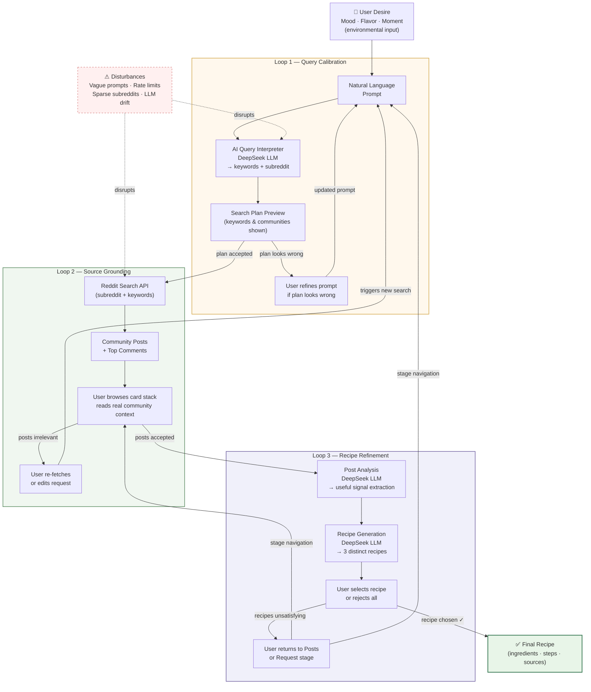

# Sip

> A quieter way to move from a drink idea to a finished recipe.

---

## Tagline

Sip turns a mood, a flavor, or a moment into a concrete drink recipe — by searching real Reddit communities and using AI to interpret what people are actually making and drinking.

---

## Project Description

Sip is a web-based drink discovery interface that bridges the gap between vague inspiration and actionable recipes. Instead of returning generic search results or pre-authored content, the app:

- **Interprets natural-language prompts** — users describe what they want in plain language ("something floral and slightly bitter", "an iced coffee for a hot afternoon")
- **Searches the right Reddit community** — an AI query planner picks the most relevant subreddit (r/tea, r/coffee, r/cocktails, r/boba, etc.) and generates search keywords specific to the prompt
- **Fetches real community posts** — the app hits the Reddit public JSON API with those keywords, pulling posts and top comments that actually match the user's request
- **Presents posts as browsable cards** — users can flip through source material one post at a time, reading excerpts and community commentary
- **Generates grounded recipes** — a second AI pass analyzes the posts and produces 3 distinct, practical drink recipes shaped by what the community actually recommends

The result is a recipe that feels discovered rather than manufactured — rooted in real people's experiences rather than a standardized database.

---

## Target Audience

**Primary users:** People who enjoy exploring new drinks and want inspiration that goes beyond generic recipe sites — home bartenders, tea enthusiasts, coffee explorers, and curious drinkers.

**Context of use:**
- Someone browsing at home, trying to figure out what to make with ingredients they have
- A person new to a drink category (e.g. exploring boba or herbal teas for the first time) who wants community-sourced guidance
- Anyone who has ever typed a vague mood into a search bar and wished the results were more personal

---

## Motivation

Most recipe discovery tools return the same top results regardless of how you phrase your query. The nuance of a request — the mood, the season, the flavor direction — gets flattened into a keyword match.

Reddit communities, by contrast, contain dense, opinionated, experience-driven content: real people describing what they made, what worked, what didn't, and why. This project asks: **can AI act as a translator between a vague human desire and the collective knowledge buried in community posts?**

The research questions being explored:

- How much does query interpretation quality affect the relevance of AI-generated recipes?
- Can a UI that shows its sources (the Reddit posts) build more trust in AI-generated content?
- What does a "community-grounded" recipe feel like compared to a purely AI-generated one?

---

## Cybernetic Systems Diagram

Sip operates as a dynamic feedback system with three nested control loops. Each loop allows the user to sense a mismatch between their intent and the system's output, and correct course before committing to the next stage.



### How the loops operate

| Loop | Trigger | Correction mechanism |
|---|---|---|
| **1 · Query Calibration** | User sees the AI's search plan before fetching posts | Rewrites prompt; AI re-interprets |
| **2 · Source Grounding** | User browses Reddit posts and finds them irrelevant | Returns to Request stage; triggers a new search with a refined prompt |
| **3 · Recipe Refinement** | User reads generated recipes and finds them off-target | Navigates back to Posts or Request; re-runs the pipeline |

Each loop tightens the system's alignment with the user's actual intent. The interface makes every intermediate output visible — search terms, source posts, AI reasoning — so users can intervene at any point rather than waiting for a final result that may miss the mark entirely.

---

## Human-Centered Design Analysis

### Affordances and Anti-Affordances

| Element | Affordance / Anti-Affordance |
|---|---|
| Free-text textarea | Affords open-ended natural language input — no fixed categories or dropdowns |
| Prompt chips ("iced matcha", "citrusy and refreshing") | Affords quick starting points for users unsure what to type |
| Stage progress pills (Request → Posts → Recipe) | Affords navigation between stages; grayed-out pills signal unreachable stages |
| Card stack with Previous/Next buttons | Affords sequential browsing; disabled buttons signal boundary conditions |
| "Build recipe" button | Only becomes meaningful after posts are loaded — the status label below it communicates readiness |
| SVG loading animation | Anti-affords interaction during loading — the animation signals "wait" without a spinner |

### Intentional Constraints

- Users cannot skip directly to the recipe stage without fetching posts first — the pipeline enforces an order that mirrors the reasoning process
- Recipe generation requires source material — the app will not fabricate recipes without at least attempting to ground them in community posts
- Post browsing is limited to the most relevant results (max 4 posts) to prevent overwhelming the user

### Signifiers

- **Stage pills** with active/inactive visual states show where the user is and where they can go
- **Status labels** under each button ("Posts: done", "Recipes: loading") make async state explicit
- **Post counter badge** ("Post 2 / 4") on the card communicates position within the stack
- **Error cards** with a "Try again" button signal failure with a clear recovery path
- **Drink-matched SVG** during recipe loading names the drink type (e.g. "Matcha", "Boba") to confirm the AI understood the request

### Visual and Interactive Cues

- Warm parchment color palette (cream, amber, brown) establishes a calm, editorial tone — evoking a field notebook rather than a tech dashboard
- Cards use subtle elevation (box-shadow) and rounded corners to suggest physical objects that can be browsed
- The card stack shows faint ghost cards behind the active card to communicate that more content exists
- Skeleton shimmer animation during post loading sets expectations before content arrives

### Feedback Mechanisms

- **Inline status labels** update in real time: `idle → loading → done / error`
- **Stage progress pills** highlight the active stage and dim unreachable ones
- **Error blocks** appear inline with contextual messages and retry actions
- **The loading animation** changes shape and color based on what the AI detected (teacup for tea, martini glass for cocktails, tall cup with pearls for boba) — confirming that the system understood the user's intent
- **Source cards in the recipe view** show which Reddit posts inspired each recipe, closing the feedback loop between input and output

### Feedback Loops

The three-stage pipeline creates an explicit feedback loop: users can return to the Posts stage after seeing recipes, browse different posts, and rebuild — encouraging iteration rather than a single linear pass.

---

## Installation

### Prerequisites

- **Node.js** v18 or later
- **npm** v9 or later
- A **DeepSeek API key** (or any OpenAI-compatible API key)

### Setup

```bash
# 1. Clone the repository
git clone <your-repo-url>
cd field-notes

# 2. Install dependencies
npm install

# 3. Create a .env file in the project root
echo "DEEPSEEK_API_KEY=your_key_here" > .env
```

Get a DeepSeek API key at [platform.deepseek.com](https://platform.deepseek.com).

### Run

```bash
npm run dev
```

Open [http://localhost:5173](http://localhost:5173) in your browser.

```bash
# Production build
npm run build
npm run preview
```

---

## Usage

### 1. Describe your drink

Type a natural-language prompt in the text area. Be as vague or specific as you like:

- *"I want something refreshing and citrusy for a summer afternoon"*
- *"A warm, slightly bitter herbal drink"*
- *"Iced matcha with a creamy texture"*

Use the prompt chips for quick inspiration.

### 2. Fetch source posts

Click **Fetch posts**. The app will:
- Ask the AI to interpret your prompt and choose a subreddit + search keywords
- Search Reddit for relevant posts
- Display them as a browsable card stack

### 3. Browse the posts

Flip through the source cards using **Previous / Next**. Each card shows the post title, excerpt, taste signals, community, and top comments.

### 4. Build your recipe

Click **Build recipe**. A drink-matched loading animation plays while the AI:
- Analyzes which posts are useful for recipe generation
- Synthesizes 3 distinct recipes grounded in the community content

### 5. Explore the recipes

Select a recipe card to see full ingredients, preparation steps, flavor profile, and the source posts that inspired it.

---

## Project Structure

```
src/
├── routes/
│   ├── +page.svelte              # Main UI — all stages, SVG animation, state
│   └── api/
│       ├── search-plan/          # POST — AI generates search keywords + subreddits
│       ├── source-posts/         # POST — fetches & normalizes Reddit posts
│       └── recipes/              # POST — analyzes posts, generates 3 recipes
└── lib/server/
    ├── reddit.js                 # Reddit public JSON API client (search + comments)
    ├── llm.js                    # DeepSeek / OpenAI structured JSON wrapper
    ├── discovery.js              # Core pipeline: fetch → analyze → generate
    └── queryInterpreter.js       # Builds the AI search plan from user prompt
```

---

## Environment Variables

| Variable | Required | Default | Description |
|---|---|---|---|
| `DEEPSEEK_API_KEY` | Yes* | — | DeepSeek API key |
| `DEEPSEEK_BASE_URL` | No | `https://api.deepseek.com` | API base URL |
| `DEEPSEEK_MODEL` | No | `deepseek-chat` | Model name |
| `OPENAI_API_KEY` | Yes* | — | Alternative to DeepSeek |
| `OPENAI_BASE_URL` | No | — | Custom OpenAI-compatible endpoint |
| `OPENAI_MODEL` | No | — | Model override |

*Either `DEEPSEEK_API_KEY` or `OPENAI_API_KEY` is required. Without one, AI features fall back to keyword-based logic.

---

## License

MIT License. See [LICENSE](LICENSE) for details.

---

## Acknowledgments

**Technologies**
- [SvelteKit](https://kit.svelte.dev/) — full-stack web framework
- [Svelte 5](https://svelte.dev/) — reactive UI with runes (`$state`, `$derived`)
- [DeepSeek](https://platform.deepseek.com/) — LLM API for query interpretation and recipe generation
- [Reddit public JSON API](https://www.reddit.com/dev/api/) — community post retrieval, no OAuth required
- [Zod](https://zod.dev/) — runtime schema validation for API routes
- [Vite](https://vitejs.dev/) — build tooling

**Design Inspiration**
- Editorial print design — field notebooks, recipe cards, zine layouts
- Don Norman's *The Design of Everyday Things* — affordances, signifiers, feedback loops
- Reddit as a knowledge archive — the idea that community discussions contain more nuanced recipe knowledge than structured databases

---

## Roadmap

### Near-term
- [ ] Save and export recipes as a shareable card or PDF
- [ ] Let users rate or bookmark posts during browsing to influence which recipes get generated
- [ ] Add more subreddit options and let users manually select communities

### Future improvements
- [ ] Multi-turn conversation — refine the recipe by chatting ("make it less sweet", "add a non-alcoholic version")
- [ ] Ingredient substitution suggestions based on what the user has at home
- [ ] Cross-community synthesis — pull posts from 2–3 different subreddits and blend perspectives
- [ ] Visual recipe cards with auto-generated illustrations
- [ ] Mobile-optimized swipe navigation for the post card stack
